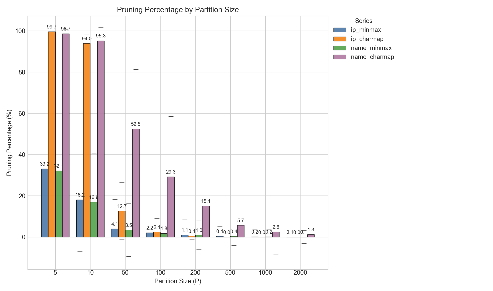
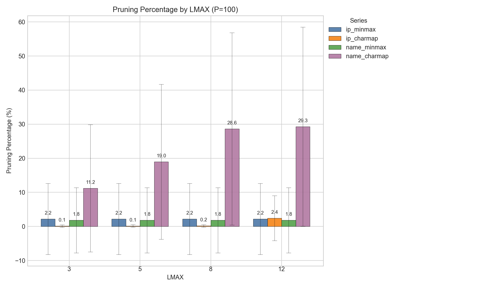
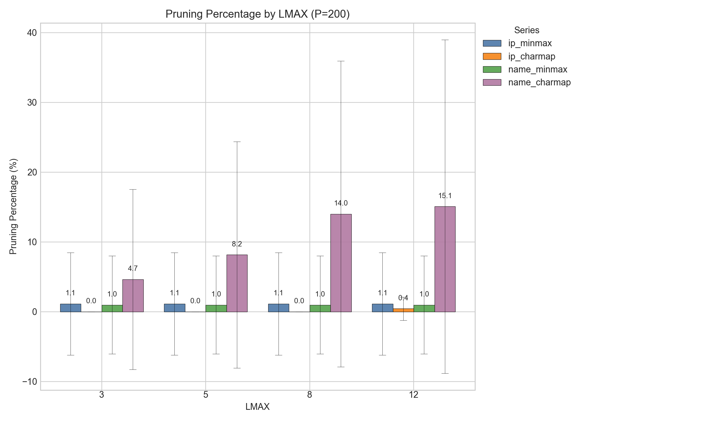
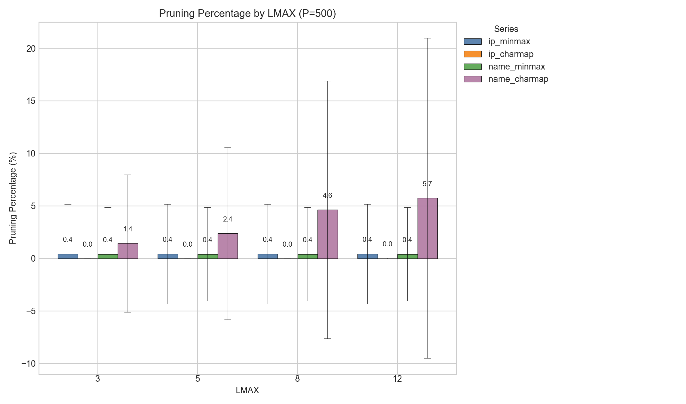

# Character Map for Efficient Partition Pruning

This repository contains the implementation, datasets, generated results, and plotting
scripts for the report `Character Map for Efficient Partition Pruning via Absence
Detection`.

The project compares a bitmap-inspired Character Map, or Charmap, against a MinMax
baseline for partition-level absence pruning on IP address and name datasets. The full
research motivation, algorithm design, experiment setup, and analysis are described in
the final report:

- [Charmap_Report.pdf](Charmap_Report.pdf)

In short, Charmap stores position-wise character presence for each partition, while
MinMax stores only the lexicographic minimum and maximum value. The stored experiment
outputs measure how many partitions each method can safely prune for each query.

## Repository Layout

```text
app/src/main/java/charmap/
  Final experiment code:
    CharMapper.java                  Character-to-bit mapping
    CharmapSummary.java              Position-wise character summary
    MinMaxSummary.java               MinMax baseline summary
    IpPrecomputeRunner.java          Shared charset formatting helper

  Final experiment runners:
    ip_and_name/
      IPCharmapPrecomputeRunner.java
      IPMinmaxPrecomputeRunner.java
      IPQueryRunner.java
      NameCharmapPrecomputeRunner.java
      NameMinmaxPrecomputeRunner.java
      NameQueryRunner.java

  Prototype / legacy code:
    PrototypeRunner.java             Early command-line filtering prototype
    CharmapIndex.java                In-memory Charmap index prototype
    MinMaxIndex.java                 In-memory MinMax index prototype
    Index.java                       Prototype index interface
    PartitionFilter.java             Prototype partition output writer
    IpQueryRunner.java               Older IP-only query experiment runner

app/src/main/resources/data/
  ip_experiment/                   IP build and query inputs
  name_experiment/                 Name build and query inputs
  results/                         Stored precompute files, query outputs, and plots
  commands.txt                     Command notes used during experiment runs

tools/
  plot_pruning_barchart.py         Partition-size sweep plot
  plot_pruning_fixed_p_lmax.py     Fixed-P Lmax sweep plots
  data_generator/                  Dataset preparation helpers
```

The active experiment results in `app/src/main/resources/data/results` are generated by
the final experiment runners and shared summary classes listed above. The prototype
files are kept for development history and earlier in-memory filtering tests, but they
are not used to generate the final stored experiment results.

## Datasets and Preprocessing

The experiments use:

- 1,000,000 build records per dataset.
- 1,000 query records per dataset.
- IP queries: 800 sampled from the build data and 200 newly generated random addresses.
- Name queries: 1,000 sampled from the name collection.

IP preprocessing:

- CIDR suffixes are ignored. For example, `192.168.1.0/24` becomes `192.168.1.0`.
- Each IPv4 octet is zero-padded to three digits.
- Dots are removed, producing a fixed-width 12-digit string.
- Example: `1.2.3.4` becomes `001002003004`.

Name preprocessing:

- Only the first name is used.
- Last names and later fields are ignored.
- Original casing is preserved.
- Unsupported characters are removed using the 64-symbol Charmap alphabet.

## Stored Results

The repository includes the generated experiment outputs:

```text
app/src/main/resources/data/results/precompute/
  ip_charmap/
  ip_minmax/
  name_charmap/
  name_minmax/

app/src/main/resources/data/results/query/
  ip_charmap/
  ip_minmax/
  name_charmap/
  name_minmax/
  pruning_summary_bar_chart.png

app/src/main/resources/data/results/fixed_p_lmax/
  p100/
  p200/
  p500/
```

Precompute files store one summary row per partition. Charmap rows are written in a
human-readable character-set format instead of raw bit vectors. Query output files store
metadata followed by one pruned-partition count per query.

The evaluation metric is average pruning ratio:

```text
pruning_ratio(query) = pruned_partitions_for_query / total_partitions
```

## Results Summary

The partition-size sweep uses:

```text
P in {5, 10, 50, 100, 200, 500, 1000, 2000}
Lmax = 12
```

The fixed-partition sweep uses:

```text
P in {100, 200, 500}
Lmax in {3, 5, 8, 12}
```

Main findings:

- Charmap is strongest at small partition sizes, where each partition contains few
  records and the position-wise character sets remain selective.
- At `P = 5`, Charmap prunes nearly all partitions: about 99.7% for IP addresses and
  98.7% for names.
- At `P = 10`, Charmap remains above 94% for both datasets, while MinMax is below 20%.
- As `P` increases, all summaries become coarser and pruning approaches zero.
- Increasing `Lmax` helps most on the name dataset, where later character positions
  add useful filtering information.
- The IP dataset responds less to larger `Lmax`, especially once `P` is 100 or larger.

### Plots

#### Partition-Size Sweep



#### Fixed-P Lmax Sweep, P=100



#### Fixed-P Lmax Sweep, P=200



#### Fixed-P Lmax Sweep, P=500



## Reproducing the Experiments

The project uses Gradle and Java 21. From the repository root:

```bash
./gradlew :app:test
```

The Gradle `:app:run` task runs with `app/` as its working directory, so Java runner
input and output paths below are written relative to `app/`.

### Partition-Size Precompute

```bash
for P in 5 10 50 100 200 500 1000 2000; do
  ./gradlew :app:run -PmainClass=charmap.IPCharmapPrecomputeRunner --args="--input src/main/resources/data/ip_experiment/1m_ip_addresses.txt --output src/main/resources/data/results/precompute/ip_charmap/ip_charmap --lmax 12 --p ${P}"
  ./gradlew :app:run -PmainClass=charmap.IPMinmaxPrecomputeRunner --args="--input src/main/resources/data/ip_experiment/1m_ip_addresses.txt --output src/main/resources/data/results/precompute/ip_minmax/ip_minmax --lmax 12 --p ${P}"
  ./gradlew :app:run -PmainClass=charmap.NameCharmapPrecomputeRunner --args="--input src/main/resources/data/name_experiment/1m_names.txt --output src/main/resources/data/results/precompute/name_charmap/name_charmap --lmax 12 --p ${P}"
  ./gradlew :app:run -PmainClass=charmap.NameMinmaxPrecomputeRunner --args="--input src/main/resources/data/name_experiment/1m_names.txt --output src/main/resources/data/results/precompute/name_minmax/name_minmax --lmax 12 --p ${P}"
done
```

### Partition-Size Query

```bash
./gradlew :app:run -PmainClass=charmap.IPQueryRunner --args="--strategy charmap --query src/main/resources/data/ip_experiment/1000_query_ips.txt --precomputeDir src/main/resources/data/results/precompute/ip_charmap --outputDir src/main/resources/data/results/query/ip_charmap"
./gradlew :app:run -PmainClass=charmap.IPQueryRunner --args="--strategy minmax --query src/main/resources/data/ip_experiment/1000_query_ips.txt --precomputeDir src/main/resources/data/results/precompute/ip_minmax --outputDir src/main/resources/data/results/query/ip_minmax"
./gradlew :app:run -PmainClass=charmap.NameQueryRunner --args="--strategy charmap --query src/main/resources/data/name_experiment/1000_query_names.txt --precomputeDir src/main/resources/data/results/precompute/name_charmap --outputDir src/main/resources/data/results/query/name_charmap"
./gradlew :app:run -PmainClass=charmap.NameQueryRunner --args="--strategy minmax --query src/main/resources/data/name_experiment/1000_query_names.txt --precomputeDir src/main/resources/data/results/precompute/name_minmax --outputDir src/main/resources/data/results/query/name_minmax"
```

### Fixed-P Lmax Sweep

The example below reproduces the `P = 200` fixed-partition sweep. Replace `p200` and
`--p 200` with `p100`/`--p 100` or `p500`/`--p 500` for the other stored runs.

```bash
for LMAX in 3 5 8 12; do
  ./gradlew :app:run -PmainClass=charmap.IPCharmapPrecomputeRunner --args="--input src/main/resources/data/ip_experiment/1m_ip_addresses.txt --output src/main/resources/data/results/fixed_p_lmax/p200/precompute/ip_charmap/ip_charmap --lmax ${LMAX} --p 200"
  ./gradlew :app:run -PmainClass=charmap.IPMinmaxPrecomputeRunner --args="--input src/main/resources/data/ip_experiment/1m_ip_addresses.txt --output src/main/resources/data/results/fixed_p_lmax/p200/precompute/ip_minmax/ip_minmax --lmax ${LMAX} --p 200"
  ./gradlew :app:run -PmainClass=charmap.NameCharmapPrecomputeRunner --args="--input src/main/resources/data/name_experiment/1m_names.txt --output src/main/resources/data/results/fixed_p_lmax/p200/precompute/name_charmap/name_charmap --lmax ${LMAX} --p 200"
  ./gradlew :app:run -PmainClass=charmap.NameMinmaxPrecomputeRunner --args="--input src/main/resources/data/name_experiment/1m_names.txt --output src/main/resources/data/results/fixed_p_lmax/p200/precompute/name_minmax/name_minmax --lmax ${LMAX} --p 200"
done

./gradlew :app:run -PmainClass=charmap.IPQueryRunner --args="--strategy charmap --query src/main/resources/data/ip_experiment/1000_query_ips.txt --precomputeDir src/main/resources/data/results/fixed_p_lmax/p200/precompute/ip_charmap --outputDir src/main/resources/data/results/fixed_p_lmax/p200/query/ip_charmap"
./gradlew :app:run -PmainClass=charmap.IPQueryRunner --args="--strategy minmax --query src/main/resources/data/ip_experiment/1000_query_ips.txt --precomputeDir src/main/resources/data/results/fixed_p_lmax/p200/precompute/ip_minmax --outputDir src/main/resources/data/results/fixed_p_lmax/p200/query/ip_minmax"
./gradlew :app:run -PmainClass=charmap.NameQueryRunner --args="--strategy charmap --query src/main/resources/data/name_experiment/1000_query_names.txt --precomputeDir src/main/resources/data/results/fixed_p_lmax/p200/precompute/name_charmap --outputDir src/main/resources/data/results/fixed_p_lmax/p200/query/name_charmap"
./gradlew :app:run -PmainClass=charmap.NameQueryRunner --args="--strategy minmax --query src/main/resources/data/name_experiment/1000_query_names.txt --precomputeDir src/main/resources/data/results/fixed_p_lmax/p200/precompute/name_minmax --outputDir src/main/resources/data/results/fixed_p_lmax/p200/query/name_minmax"
```

### Plot Generation

Plot scripts are run from the repository root:

```bash
python3 tools/plot_pruning_barchart.py \
  --query-dir app/src/main/resources/data/results/query \
  --lmax 12 \
  --output app/src/main/resources/data/results/query/pruning_summary_bar_chart.png

python3 tools/plot_pruning_fixed_p_lmax.py \
  --query-dir app/src/main/resources/data/results/fixed_p_lmax/p200/query \
  --p 200 \
  --lmax-values 3,5,8,12 \
  --output app/src/main/resources/data/results/fixed_p_lmax/p200/plots/pruning_vs_lmax_P200.png
```
